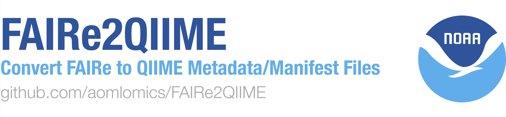

<div align="center">
  
</div>

# FAIRe2QIIME

This script converts NOAA FAIRe Excel metadata into QIIME2-compatible metadata and manifest files for downstream analysis.

## Features

- Reads project, sample, and experiment-run metadata from an Excel file
- Generates metadata files for each assay (named with marker gene and subfragment)
- Generates manifest files for each sequencing run (named with seq_run_id) and assay (named with marker gene and subfragment)
- Duplicate columns in sample or project metadata will be appended with "_SAMPLE" or "_PROJECT", respectively
- "samp_name" column is renamed to "sample_name" to be compatible with QIIME 2

## Requirements

- Python 3.7+
- pandas

## Usage

```sh
python faire2qiime.py --path_faire <path_to_excel> --absolute_path_sequences <sequences_dir> --output_directory <output_dir>
```

### Arguments

- `--path_faire` : Path to the FAIRe Excel file containing metadata
- `--absolute_path_sequences` : Absolute path to the directory containing sequence files
- `--output_directory` : Directory to save output metadata and manifest files

### Example

```bash
python faire2qiime.py \
  --path_faire 'FAIRe-NOAA_myproject.xlsx' \
  --absolute_path_sequences '/path/to/folder/with/seq_run_ids' \
  --output_directory .
```

## Output

- Metadata TSV files for each assay, named like `<project_id>>_<assay_short>_metadata.tsv`
- Manifest TSV files for each sequencing run, named like `<seq_run_id>_<assay_short>_manifest.tsv`

## Troubleshooting

- Ensure all required columns are present in the Excel file
- If you see errors about file paths, check that your sequence directory and filenames are correct
- For pandas import errors, install pandas: `pip install pandas`

## License

[CC0](https://creativecommons.org/public-domain/cc0/)

## Disclaimer

This repository is a scientific product and is not official communication of the National Oceanic and Atmospheric Administration, or the United States Department of Commerce. All NOAA GitHub project code is provided on an 'as is' basis and the user assumes responsibility for its use. Any claims against the Department of Commerce or Department of Commerce bureaus stemming from the use of this GitHub project will be governed by all applicable Federal law. Any reference to specific commercial products, processes, or services by service mark, trademark, manufacturer, or otherwise, does not constitute or imply their endorsement, recommendation or favoring by the Department of Commerce. The Department of Commerce seal and logo, or the seal and logo of a DOC bureau, shall not be used in any manner to imply endorsement of any commercial product or activity by DOC or the United States Government.
